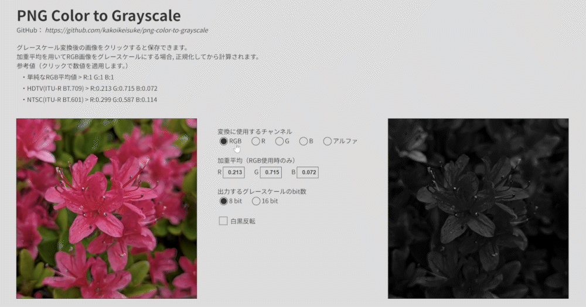

# PNG Color to Grayscale
PNG形式のカラー画像をグレースケール画像に変換します。  
こちらから使用することができます。  
[https://kakoikeisuke.github.io/png-color-to-grayscale](https://kakoikeisuke.github.io/png-color-to-grayscale)  

## 概要
PNG画像を選択すると, ローカルでグレースケール画像に変換します。  
変換結果の画像をクリックすると保存することができます。  

## 変換方法
実装されているカラー画像をグレースケールに変換する方法は次の2通りです。  
- RGBの平均を取得してグレースケールにする方法
- RGBAのチャンネルのどれか1つを抽出する形でグレースケールにする方法  

なお, RGBの平均を使用する場合には, それぞれの値に対して重みをつけて平均を出す加重平均法を使用できます。

## その他
- カラー画像ではなくグレースケール画像を読み込もうとするとエラーになります。
- RGB平均から変換する場合, アルファチャンネルは考慮されません。
- 記載されている加重平均の補正値はあくまで参考値です。
- 加重平均の補正値は処理時に自動で正規化されます。